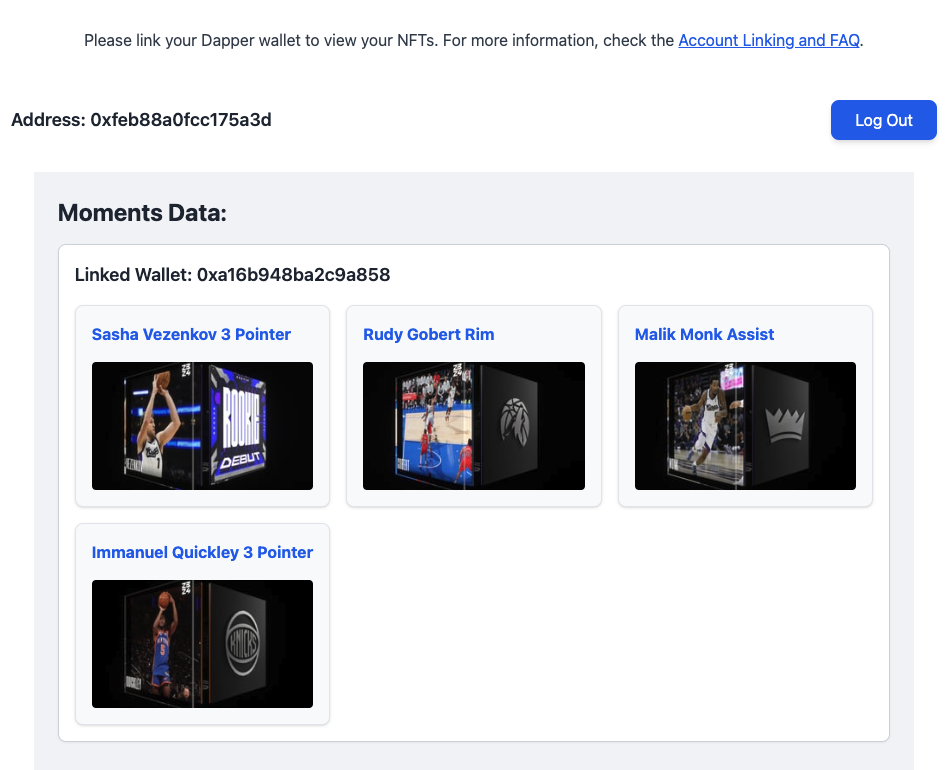

# 🏀 Next.js + Flow: NBA Top Shot Account Linking Demo

This demo showcases how to use **Flow Account Linking** to view **NBA Top Shot Moments** from a user's **Dapper Wallet** using their **Flow Wallet** login. No asset transfers or separate Dapper login required.

> ✅ Built with Next.js (App Router) + Flow FCL + Cadence  
> 🔗 Try it live: [nextjs-topshot-account-linking.vercel.app](https://nextjs-topshot-account-linking.vercel.app)  
> 🧠 Learn to build it: [Account Linking With NBA Top Shot](https://developers.flow.com/build/guides/account-linking-with-dapper)

---

## 📸 Preview



---

## 🧠 What You'll Learn

- Pull your users' NBA Top Shot Moments into your Flow app without needing to transfer them out of their Dapper wallet
- Retrieve and list all NFT collections in any child wallet linked to a given Flow address
- Write a [Cadence](https://cadence-lang.org) script to iterate through the storage of a Flow wallet to find NFT collections
- Run Cadence Scripts from the frontend

---

## 🚀 Getting Started

**WARNING:** You're much better off completing the tutorial linked above.  This is **not** a scaffold for a production app.

### 1. Fork and Clone this repo

Click the `Fork` button in the upper right.  Clone your fork.

```bash
git clone https://github.com/<YOUR_GITHUB_HANDLE>/nextjs-topshot-account-linking.git
cd nextjs-topshot-account-linking
```

### 2. Install dependencies

```bash
yarn install
```

### 3. Set up environment variables

Create a `.env` file:

```env
NEXT_PUBLIC_ACCESS_NODE_API=https://rest-mainnet.onflow.org
NEXT_PUBLIC_FLOW_NETWORK=mainnet
NEXT_PUBLIC_WALLETCONNECT_ID=<your_walletconnect_project_id>
```

> 🔐 You'll need a [WalletConnect Project ID](https://cloud.walletconnect.com/).

### 4. Install Flow CLI

You'll need the Flow CLI to continue working with this project.

```bash
brew install flow-cli
```

### 5. Run the Project

```bash
yarn dev
```

---

## 🧩 Key Features

- 🔐 **Log in with Flow wallet**
- 🔄 **List NFTs from linked child accounts**
- 📦 **Script: Fetch NFTs with MetadataViews**
- 💅 **Styled with Tailwind CSS**

---

## 📁 Project Structure

```bash
.
├── app/
│   ├── components/              # NFT display logic
│   ├── hooks/                   # Flow login state
│   ├── providers/               # AuthProvider context
│   ├── cadence/scripts/         # Cadence script to fetch NFTs
│   ├── layout.tsx               # App-level FCL setup
│   └── page.tsx                 # Main app UI
├── flow.json                    # Flow config
├── .env                         # Access Node + WalletConnect
└── public/
```

---

## 🛠 Scripts & Contracts

Cadence script: `FetchNFTsFromLinkedAccts.cdc`

- Uses [`HybridCustody`](https://github.com/onflow/hybrid-custody) to iterate child wallets
- Filters for NFT collections with accessible capabilities
- Reads metadata via `MetadataViews.Display`

---

## 👛 Requirements

- A [Flow Wallet](https://wallet.flow.com) to log in
- A [Dapper Wallet](https://meetdapper.com) with NBA Top Shot Moments
- [Account linking](https://support.meetdapper.com/hc/en-us/articles/20744347884819-Account-Linking-and-FAQ) completed between your wallets

---

## 📚 Resources

- [Account Linking With NBA Top Shot](https://developers.flow.com/build/guides/account-linking-with-dapper)
- [Account Linking Guide](https://developers.flow.com/build/guides/account-linking-with-dapper)
- [Hybrid Custody Contract](https://github.com/onflow/hybrid-custody)
- [FCL Docs](https://developers.flow.com/tools/clients/fcl-js)

---

## 🧪 Development Notes

- This project uses `"use client"` and suppresses hydration warnings for simplicity.
- In production, you'll want to:
  - Handle large NFT collections with pagination
  - Filter for known contract types only
  - Harden the Cadence script against storage structure changes

---

## 🧑‍💻 Author

**Brian Doyle** – [@briandoyle81](https://github.com/briandoyle81)

---

## 🪄 License

MIT
